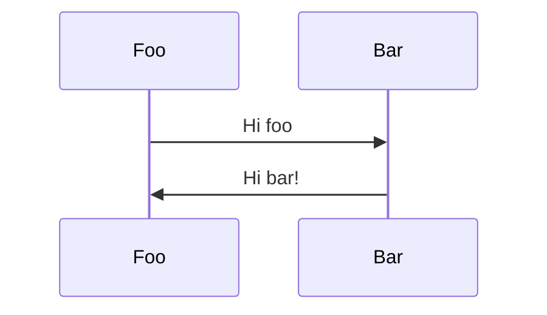

# Personal Access Token

Consequuntur blanditiis sed. Culpa qui dolorem. Autem aliquam officiis. Temporibus est reprehenderit.

Eaque amet fugiat hic aut provident. Non eveniet officiis tenetur reprehenderit est qui laborum. Quidem rerum autem autem culpa possimus suscipit. Sint ducimus incidunt. Qui et qui vel quod quidem quibusdam ut sapiente sit.

Harum voluptas quod et fuga et. Molestiae illo officiis token repellendus. Modi excepturi eum cum et quam qui. Doloremque non sequi. Vero aut mollitia ad qui debitis.

## Code Groups

::: code-group

```php [PHP]
<?php
function verifySignature(
    string $payloadBody,
    string $sharedSecret,
    string $webhookSignature
): void
{
    $decodedSignature = base64_decode($$webhookSignature);
    $expectedSignature = hash_hmac('sha256', $payloadBody, $sharedSecret, true);
    if (!hash_equals($decodedSignature, $expectedSignature)) {
        throw new InvalidArgumentException('Webhook signature is invalid');
    }
}

try {
    // Raw webhook payload body
    $payloadBody = ''; // e.g. file_get_contents('php://input');
    // Shared webhook secret
    $sharedSecret = '';
    // Value of signature from the request headers
    $webhookSignature = '';  // e.g. $_SERVER['X_AQID_SIGNATURE'];

    verifySignature($payloadBody, $sharedSecret, $webhookSignature);
} catch (InvalidArgumentException $e) {
    // Webhook signature is invalid
    echo 'Error:' . $e->getMessage();
}
```

```python [Python]
import base64
import hashlib
import hmac

def verify_signature(payload_body, shared_secret, webhook_signature):
    decoded_signature = base64.b64decode(webhook_signature)
    expected_signature = hmac.new(shared_secret.encode(), payload_body.encode(), hashlib.sha256).digest()

    if not hmac.compare_digest(decoded_signature, expected_signature):
        raise Exception('Webhook signature is invalid')

try:
    # Raw webhook payload body
    payload_body = ''
    # Shared webhook secret
    shared_secret = ''
    # Value of signature header (X-AQID-Signature)
    webhook_signature = ''

    verify_signature(payload_body, shared_secret, webhook_signature)
except Exception as e:
    # Webhook signature is invalid
    print('Error:', str(e))
```

```javascript [Node.js]
const crypto = require('crypto');

function verifySignature(payloadBody, sharedSecret, webhookSignature) {
  const decodedSignature = Buffer.from(webhookSignature, 'base64');
  const computedSignature = crypto
    .createHmac('sha256', sharedSecret)
    .update(payloadBody)
    .digest();

  if (!crypto.timingSafeEqual(decodedSignature, computedSignature)) {
    throw new Error('Webhook signature is invalid');
  }
}

try {
  // Raw webhook payload body
  const payloadBody = '';
  // Shared webhook secret
  const sharedSecret = '';
  // Value of signature from the request headers
  const webhookSignature = '';

  verifySignature(payloadBody, sharedSecret, webhookSignature);
} catch (error) {
  // Webhook signature is invalid
  console.error('Error:', error.message);
}
```

:::

## Flow Diagrams


